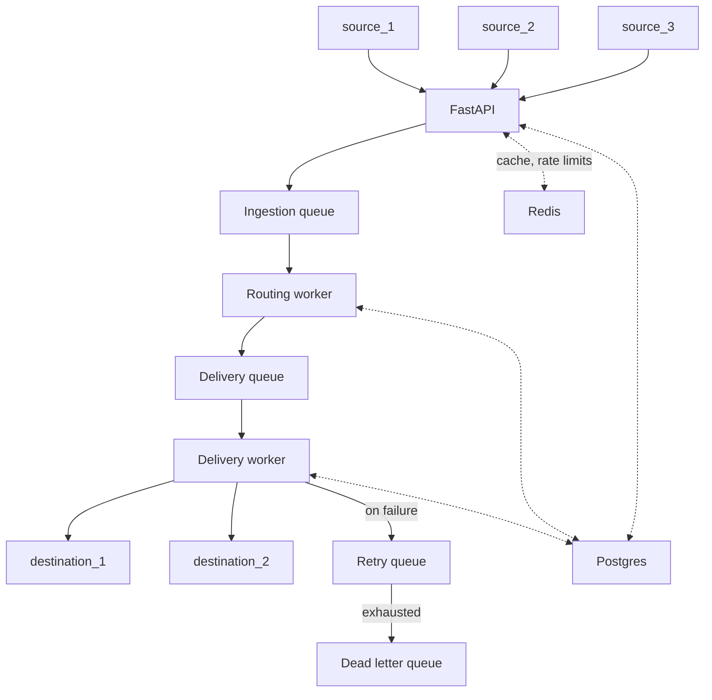

# Webhook Relay

## System Overview and Architecture

The main goal of this project is to guarantee "at least once" delivery of webhooks from incoming sources to configured destinations. While a quick-and-dirty solution to the webhook delivery problem may be built using an automation platform such as n8n or Zapier, the question of robustness still remains. This project allows the user to filter and deduplicate incoming webhook payloads, configure rate limits, configure retries of failed webhook deliveries to destinations, and if all else fails, manually resend webhook requests. It is assumed that the destination is idempotent, since a single request may be delivered multiple times.

The five primary entities in this project are requests, events, sources, destinations, and connections. The ingestion pipeline begins with an incoming request from a source. The ingestion endpoint ensures that the incoming request is validated and authenticated using HMAC signature verification or API keys, logs the request, and pushes it into the ingestion queue for further processing.

A connection is a mapping between a source and a destination. Each connection may have zero or more rules such as deduplication, filtering, and retry policies, that govern how requests are processed and delivered. Fan-out connections may also exist, where a single source is mapped to multiple destinations.

A worker process reads from the ingestion queue, looks up the relevant connections, and applies the associated rules to the request payload. If the request passes these rules, a new event is created, its metadata logged, and then pushed into the delivery queue.

A worker process reads events from the delivery queue and attempts to deliver each event to the configured destination in the connection. If delivery fails, the event enters the retry queue, and after multiple failed retries, enters the dead letter queue (from which a user may retry manually). Each delivery attempt is also logged in order to facilitate easier debugging.

The project also has a management API that allows the user to create, view, edit, and delete sources, destinations, and connections. The user may also use this API to view requests and events (along with associated delivery attempts).

## Technologies

| Component | Role |
|---|---|
| **FastAPI** | The main application used to ingest and process requests. |
| **Postgres** | The primary database. |
| **RabbitMQ** | A single instance with four logical queues: an ingestion queue, a delivery queue, a retry queue, and a dead letter queue. |
| **Celery** | Used in its default prefork mode. Two Celery worker pools: one consuming from the ingestion queue (for routing and rule evaluation), and one consuming from the delivery and retry queues (for HTTP delivery to destinations). Each pool runs as a parent process with 4 child worker processes. |
| **Redis** | Used for caching and rate limiting. Policies are detailed in the [Caching and Rate Limiting](#caching-and-rate-limiting) section. |
| **React** | For the user dashboard. |
| **Docker / Docker Compose** | All of the above components are run in Docker containers and orchestrated by Compose. |

**Implementation note:** the initial build uses two physical RabbitMQ queues (ingestion and delivery). Retries are handled via Celery's built-in `self.retry(countdown=...)`, and dead-lettered events are tracked by database state. A later iteration will migrate to dedicated RabbitMQ retry and dead-letter queues using per-message TTL and dead-letter exchanges.

## Failure Modes

**FastAPI failure:**
The connection is simply refused, and Docker's restart policy restarts the container.

**Redis failure:**
A Redis crash would invalidate the system cache and rate limits. Cached entries may be fetched directly from Postgres; however, handling rate limiting is more involved. In the case of inbound traffic rate limits, the system accepts all incoming requests. The case of outbound traffic is more critical, since destination servers should not be overwhelmed. In this case, events remain queued until Redis is back online.

**RabbitMQ failure:**
There are two possibilities: either the buffer is full or the broker itself crashes. In either case, the application responds to the source with a 503 error. In the latter case, Docker restarts the container. If queues are configured as durable with persistent messages, they survive the restart.

**Celery worker failure:**
Messages in RabbitMQ remain unacked and are eventually re-queued. This is how at-least-once delivery is guaranteed: the worker only acks the message once processing is complete. The Docker restart policy handles restarts in this case as well.

**Postgres failure:**
This is the most critical failure. All request processing halts and the application returns a 503 for all incoming requests. The Celery workers reject the messages being processed, which are then re-queued and re-delivered once Postgres is back online.

## Caching and Rate Limiting

The system uses a simple cache-aside pattern and explicit invalidation of cached entries, coupled with time-to-live (TTL) in case invalidation fails. The following entries are cached: source configuration information (HMAC algorithm, API keys, HTTP request headers, etc.) and connection information for sources. Both are frequently read and infrequently updated, making them ideal candidates for caching.

Sliding window counter rate limiting is used for both inbound (per source) and outbound (per destination) requests. This pattern is used since it is fairly simple to implement, does not use excessive memory, and is quite accurate.

## Data Model

All tables include `created_at` and `updated_at` timestamps unless otherwise stated. `id` is the primary key in all tables unless otherwise stated. Entity IDs are prefixed following this convention: `src_`, `des_`, `req_`, `con_`, `evt_`.

### users

| Column | Type | Notes |
|---|---|---|
| id | PK | |
| name | | |
| email | | |
| password_hash | | |
| org_id | FK | |
| role_id | FK | |
| auth_provider | | e.g. `google`, `github`, `local` |
| auth_provider_id | | |

Relationships: user:org - n:1, user:role - n:1, user:project - m:n

### roles

| Column | Type | Notes |
|---|---|---|
| id | PK | |
| name | | `admin`, `user` |

Relationships: role:permission - m:n

### permissions

| Column | Type | Notes |
|---|---|---|
| id | PK | |
| permission_name | | e.g. `create_org`, `create_project`, `edit_project`, `create_connection`, `edit_connection` |

### role_permissions

| Column | Type | Notes |
|---|---|---|
| role_id | PK, FK | |
| permission_id | PK, FK | |

### organizations

| Column | Type | Notes |
|---|---|---|
| id | PK | |
| name | | |

### projects

| Column | Type | Notes |
|---|---|---|
| id | PK | |
| signing_secret_key | | Used for HMAC-signing outbound deliveries |
| org_id | FK | |

Relationships: organization:project - 1:n, project:source - 1:n, project:destination - 1:n, project:connection - 1:n

### user_projects

| Column | Type | Notes |
|---|---|---|
| user_id | PK, FK | |
| project_id | PK, FK | |

### sources

| Column | Type | Notes |
|---|---|---|
| id | PK | Also used as the ingestion URL path parameter |
| project_id | FK | |
| type | | `github`, `stripe`, `shopify`, `third_party_webhook` |
| name | | |
| allowed_methods | | e.g. `[POST, DELETE]` |
| auth | boolean | |
| auth_type | | `hmac`, `api_keys` |
| auth_config | JSONB | `{ api_key_header, api_key, hmac_algorithm, hmac_encoding, hmac_header, hmac_signing_secret }` |

Relationships: source:connection - 1:n

### destinations

| Column | Type | Notes |
|---|---|---|
| id | PK | |
| project_id | FK | |
| type | | `HTTP` |
| name | | |
| url | | |
| auth_type | | `hmac` |
| rate_limit | integer | Requests per second |

Relationships: destination:connection - 1:n

### connections

| Column | Type | Notes |
|---|---|---|
| id | PK | |
| name | | |
| source_id | FK | |
| destination_id | FK | |
| project_id | FK | |
| rules | JSONB | Array of rule objects. Example: `[{"type": "filter", "schema": {...}}, {"type": "deduplicate", "window": 600}, {"type": "retry", "count": 5, "interval": 30, "strategy": "exponential"}]` |

Relationships: connection:event - 1:n

### requests

| Column | Type | Notes |
|---|---|---|
| id | PK | |
| project_id | FK | |
| source_id | FK | Also the source URL path parameter |
| headers | JSONB | |
| payload | JSONB | |
| state | | `accepted`, `rejected` |
| rejection_cause | | |
| discarded | boolean | True if all connections produced ignored events |
| payload_hash | | Used for deduplication |

Relationships: project:request - 1:n

### events

| Column | Type | Notes |
|---|---|---|
| id | PK | |
| connection_id | FK | |
| project_id | FK | |
| state | | `success`, `pending`, `failed`, `ignored` |
| request_id | FK | |
| ignore_cause | | Reason for filtering/deduplication |
| retry_attempts | integer | |
| last_retry_at | timestamp | |
| next_retry_at | timestamp | |
| state_updated_at | timestamp | |

Relationships: request:event - 1:n, event:delivery_attempt - 1:n

### event_delivery_attempts

| Column | Type | Notes |
|---|---|---|
| id | PK | |
| event_id | FK | |
| attempt_number | integer | |
| status_code | integer | |
| response_body | TEXT | Truncated, nullable |
| error | | |
| attempted_at | timestamp | |
| latency_ms | integer | |

## API

Pagination is enabled for all endpoints that return a list of items.

### Ingestion

`POST /webhooks/:source_id` - Ingest and process incoming webhook requests. Maximum accepted payload size is 1MB; anything larger is rejected with a 413.

### Organizations

`POST /orgs` - Create a new organization.

### Projects

`GET /projects` - List projects.

`POST /projects` - Create a project.

`GET /projects/:id` - Get a project.

`PUT /projects/:id` - Update a project.

`DELETE /projects/:id` - Delete a project.

### Sources

`GET /projects/:project_id/sources` - List sources.

`POST /projects/:project_id/sources` - Create a source.

`GET /projects/:project_id/sources/:id` - Get a source.

`PUT /projects/:project_id/sources/:id` - Update a source.

`DELETE /projects/:project_id/sources/:id` - Delete a source.

### Destinations

`GET /projects/:project_id/destinations` - List destinations.

`POST /projects/:project_id/destinations` - Create a destination.

`GET /projects/:project_id/destinations/:id` - Get a destination.

`PUT /projects/:project_id/destinations/:id` - Update a destination.

`DELETE /projects/:project_id/destinations/:id` - Delete a destination.

### Connections

`GET /projects/:project_id/connections` - List connections.

`POST /projects/:project_id/connections` - Create a connection.

`GET /projects/:project_id/connections/:id` - Get a connection.

`PUT /projects/:project_id/connections/:id` - Update a connection.

`DELETE /projects/:project_id/connections/:id` - Delete a connection.

### Requests

`GET /projects/:project_id/requests` - List requests.

`GET /projects/:project_id/requests/:id` - Get a request (includes full payload and headers).

Supported filters (query params): `time_range`, `status`, `source_id`.

### Events

`GET /projects/:project_id/events` - List events.

`GET /projects/:project_id/events/:id` - Get an event (includes nested delivery attempts).

Supported filters (query params): `status`, `connection_id`, `time_range`, `source_id`, `destination_id`.

### Replay

`POST /projects/:project_id/events/:event_id/replay` - Manually retry a failed event from the dead letter queue.

### Signing Secret Rotation

`POST /projects/:project_id/rotate-signing-secret` - Rotate the project's signing secret used for HMAC-signing outbound deliveries.

### Health Check

`GET /health` - Verifies that the application can reach its dependencies. Pings Postgres (`SELECT 1`), Redis (`PING`), and RabbitMQ (connection check). Returns 200 if all three are reachable, 503 if any are down. Docker Compose uses this endpoint to determine whether a container is healthy.